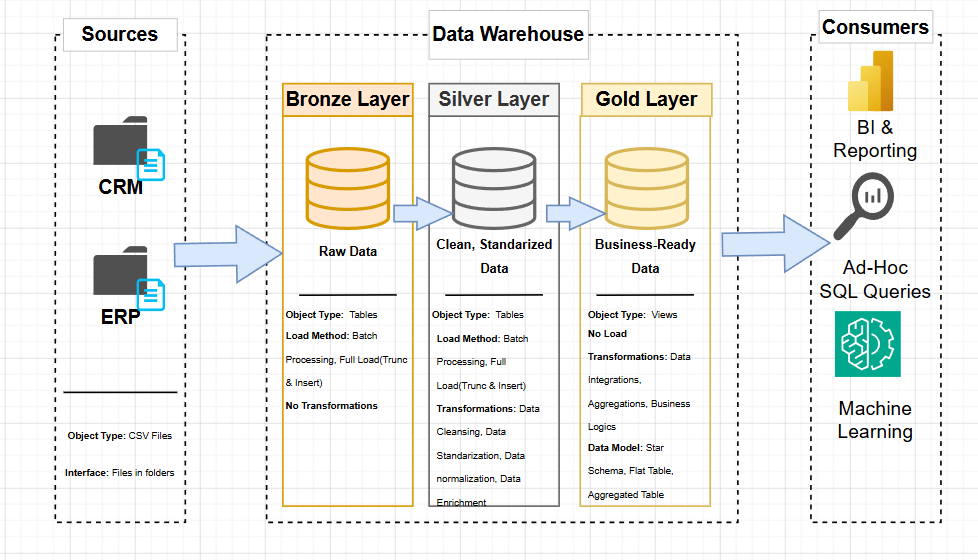

# Data Warehouse Project

Welcome to the **Data Warehouse & Analaytics Project** repo!
This project demonstrates a data warehousing and analytics solution, from building a data warehouse to generating useful and actionable insights.
It highlights best practices in data engineering and analytics.

---

## Data Architecture

The data architecture for this project follows the Medallion Architecture **Bronze**, **Silver**, and **Gold** layers:

---

## Project Overview

This project involves:

1. **Data Architecture**: Designing a Modern Data Warehouse Using Medallion Architecture **Bronze**, **Silver**, and **Gold** layers.
2. **ETL Pipelines**: Extracting, transforming, and loading data from source systems into the warehouse.
3. **Data Modeling**: Developing fact and dimension tables optimized for analytical queries.
4. **Analytics & Reporting**: Creating SQL-based reports and dashboards for actionable insights.

---

## BI: Analytics & Reporting (Data Analysis)

## Objective
Develop SQL-based analytics to deliver detailed insights into:
- **Customer Behavior**
- **Product Performance**
- **Sales Trends**

These insights empower stakeholders with key business metrics, enabling strategic decision-making.  

---

## About Me

 I'm **Charalambos Kouppis**. I’m an Applied Informatics in my final year and i'm very interested in working with data!
 Let's Connect: https://www.linkedin.com/in/charalambos-kouppis-a58770294/
